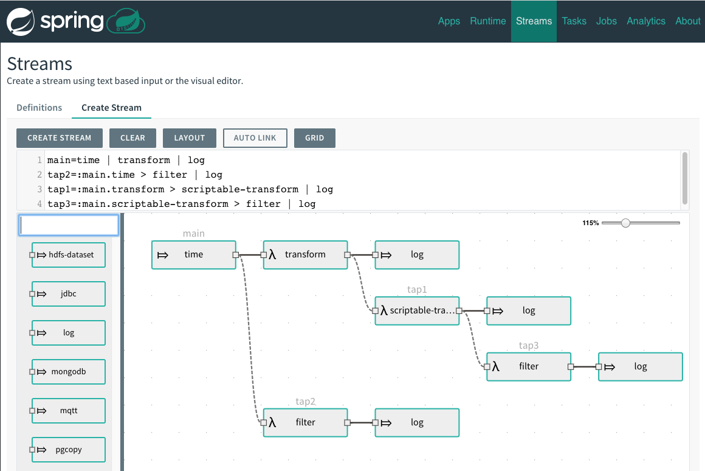

# Spring Flo

 

Spring Flo is a JavaScript library that offers a basic embeddable HTML5 visual builder for pipelines and simple graphs. This library is used as the basis of the stream builder in Spring Cloud Data Flow.

Here is a [youtube video](https://www.youtube.com/watch?v=78CgV46OstI) of Spring Flo in action.

## Consuming Spring Flo

Refer to the [wiki](https://github.com/spring-projects/spring-flo/wiki) for more information on how to embed it in an application.

## Build

Spring Flo is built using NPM commands. Simplest way to build is via `npm run build` to build the project and run the tests (Prerequisite for th build is `npm install` executed before the build command is). Build results are produced under the __dist__ folder.

## Getting Help

If you have any questions, issues, feedback or feature request please [raise an issue](https://github.com/spring-projects/spring-flo/issues).

## Samples

A small self contained sample usage of Spring Flo is available in the [demo](https://github.com/spring-projects/spring-flo/tree/master/src/demo) sub folder. Execute `npm start` to run the sample. The [Spring Cloud Data Flow UI](https://github.com/spring-cloud/spring-cloud-dataflow-ui) at github shows a larger scale usage of Spring Flo.

## Contributing

Pull requests are welcome, but before accepting them we will need you to sign the [Contributors Agreement](https://support.springsource.com/spring_committer_signup).

## License

Spring Flo is Open Source software released under the [Apache 2.0 license](https://www.apache.org/licenses/LICENSE-2.0.html).
