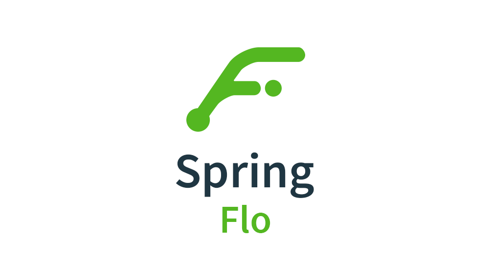
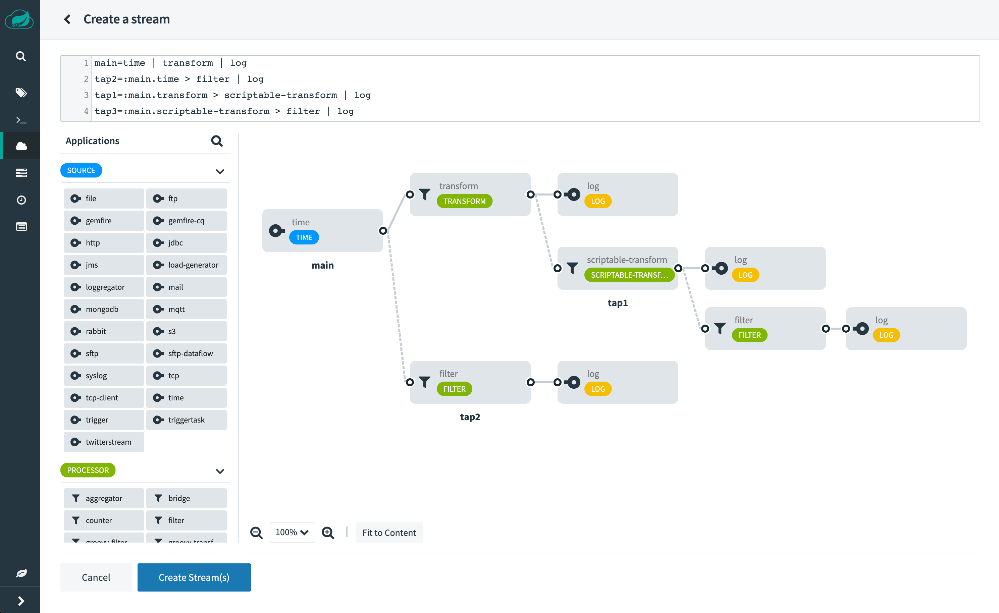

  

  
  

  <a href="#introduction">Introduction</a> •
  <a href="#how-to-use">How To Use</a> •
  <a href="#acknowledgments">Acknowledgments</a>

## Introduction

**Spring Flo** is a JavaScript library that offers a basic embeddable HTML5 visual builder for pipelines and simple graphs. 
This library is used as the basis of the stream builder in **Spring Cloud Data Flow**.

Here is a [youtube video](https://www.youtube.com/watch?v=78CgV46OstI) of **Spring Flo** in action.

---

## How To Use

Refer to the [wiki](https://github.com/spring-projects/spring-flo/wiki) for more information on how to embed it in an application.

Please ensure that at a minimum [Node.js][], [npm][] and the [Angular CLI][] are available on your system. In order to execute the build simply do:

	$ git clone https://github.com/spring-projects/spring-flo.git
	$ npm install
	$ npm run build
	
Build results are produced under the __dist__ folder.

A small self contained sample usage of **Spring Flo** is available in the [demo](https://github.com/spring-projects/spring-flo/tree/master/src/demo) sub folder. Execute `npm start` to run the sample. 
The [Spring Cloud Data Flow UI](https://github.com/spring-cloud/spring-cloud-dataflow-ui) at github shows a larger scale usage of **Spring Flo**.

**Spring Flo** is Open Source software released under the [Apache 2.0 license](https://www.apache.org/licenses/LICENSE-2.0.html).

Pull requests are welcome, but before accepting them we will need you to sign the [Contributors Agreement](https://support.springsource.com/spring_committer_signup).

---

## Acknowledgments

This project uses code from several open source packages:
[JointJS](https://www.jointjs.com/),
[CodeMirror](https://codemirror.net/) (...).

This project is powered by:

 

[Angular]: https://angular.io/
[Angular CLI]: https://cli.angular.io/
[Node.js]: https://nodejs.org/
[npm]: https://www.npmjs.com/
