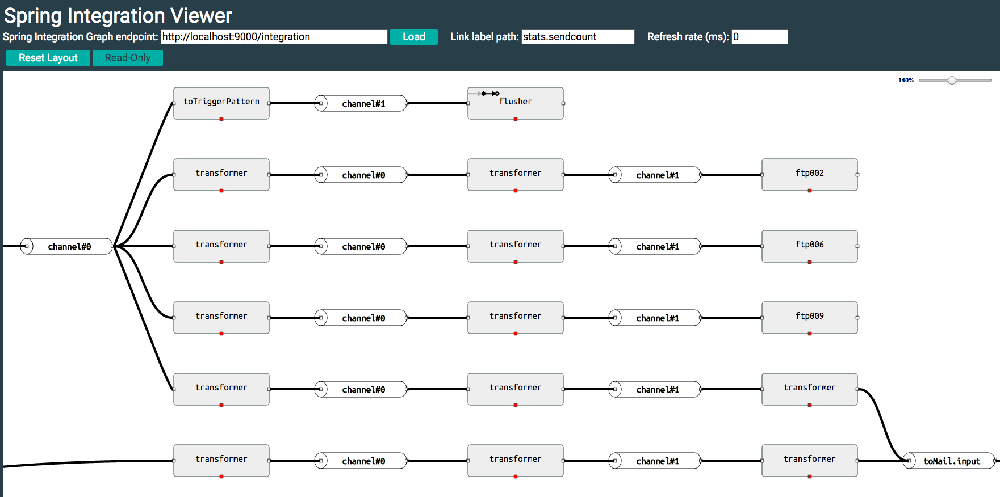
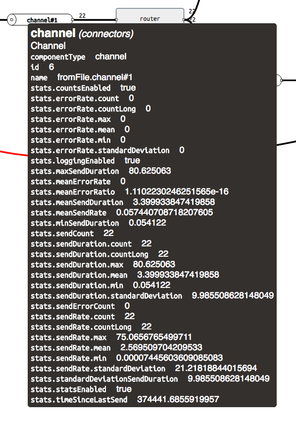
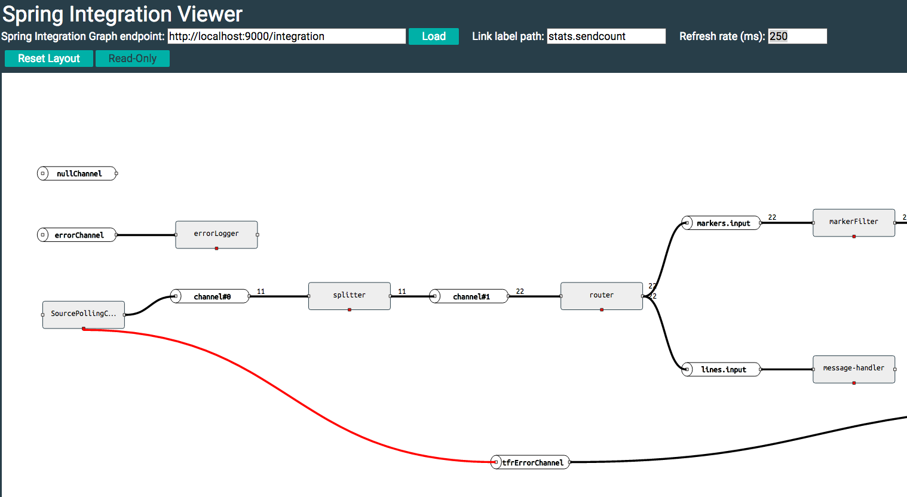

# A sample app using spring-flo to visualize Spring Integration applications

This sample uses flo as a live viewer for Spring Integration applications.

This https://spring.io/blog/2016/04/26/spring-integration-4-3-m2-is-available[blog] discusses
how to activate the new endpoint in a Spring Integration application. When
the endpoint is active in your SI application, just enter that into the spring
flo viewer. You should then see something like this:

# Running the sample

A basic Spring Boot app is used to serve the sample. Launch it with:

    mvn spring-boot:run

then open `http://localhost:8082`. In the `Spring Integration Graph Endpoint`
field enter the url for the spring integration data, for example: `http://localhost:8080/integration`
and the graph should load.

# Using the application

Once the graph is loaded you can drag nodes around to adjust the layout. (Press the `Read-Only`
button to prevent moving nodes around).  Hovering over a node will show a tool tip with more
information for that element. If you hover over a channel you will see many stats about
traffic flowing over that channel:

It is possible to select one of those stats of interest and have it shown directly on the graph.
Simply select what you are interested in and enter the name of that stat in the `Link label path`
field at the top. The values for that stat will then be shown on the links between graph
elements:

If you enter a Refresh rate (minimal allowed is 250ms) then that stat will actually
update on the graph at that rate with a small animation indicating where on the graph changes
in value are occurring.

